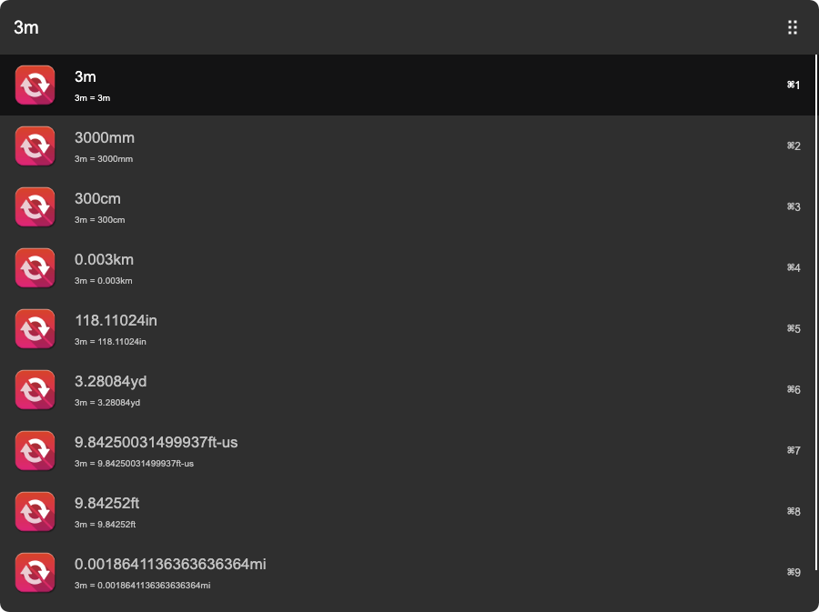
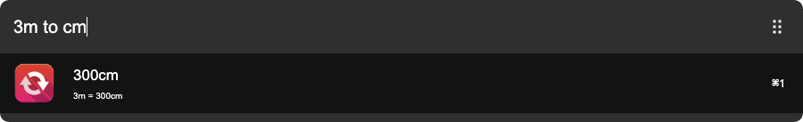
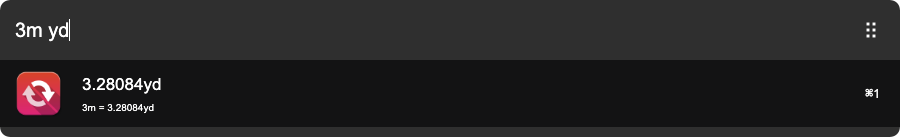

# arvis-convert-unit-plugin
[](http://badge.fury.io/js/arvis-convert-unit-plugin)
[](http://badge.fury.io/js/arvis-convert-unit-plugin)
[](https://lbesson.mit-license.org/)
[](http://makeapullrequest.com)
[](https://GitHub.com/jopemachine/arvis-convert-unit-plugin/issues/)

Convert units easily in [Arvis](https://github.com/jopemachine/arvis)







## Installation

```
$ npm i -g arvis-convert-unit-plugin
```

## Related

- [convert-units](https://github.com/convert-units/convert-units) - API for this module.

- [arvish](https://github.com/jopemachine/arvish) - Arvis workflow, plugin creator tools

- [other plugins](https://github.com/jopemachine/arvis/blob/master/documents/plugin-links.md)

## Icon source

This plugin uses below icon sources

[iconarchive.com](https://iconarchive.com/show/flatwoken-icons-by-alecive/Apps-Accessories-Media-Converter-icon.html)
